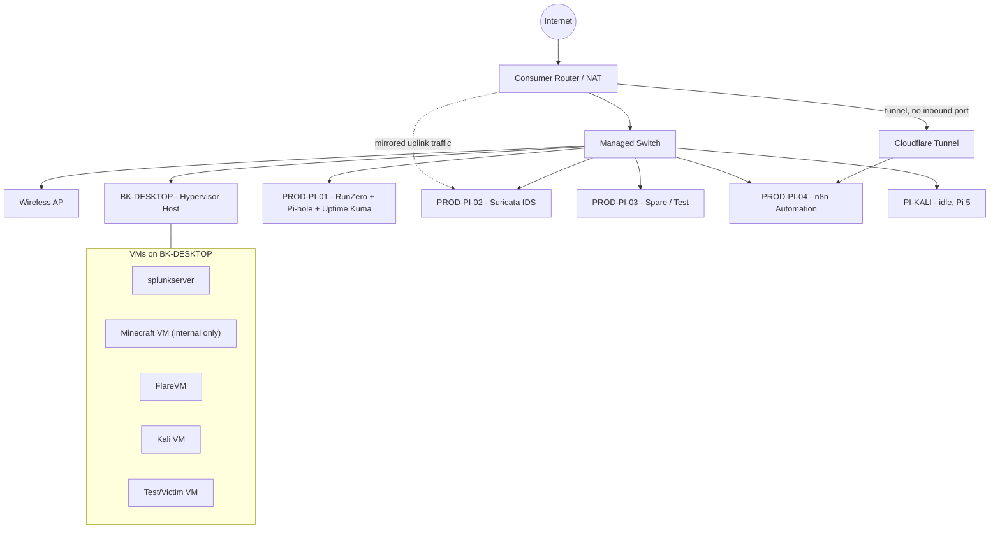

# Diagram of Lab

```mermaid
flowchart TD
    INTERNET((Internet))
    RTR[Consumer Router / NAT]
    CF[Cloudflare Tunnel]
    SW[Managed Switch]
    AP[Wireless AP]
    BK[BK-DESKTOP - Hypervisor Host]
    PI1[PROD-PI-01 - RunZero + Pi-hole + Uptime Kuma]
    PI2[PROD-PI-02 - Suricata IDS]
    PI3[PROD-PI-03 - Spare / Test]
    PI4[PROD-PI-04 - n8n Automation]
    PIK[PI-KALI - idle, Pi 5]

    INTERNET --> RTR
    RTR -->|tunnel, no inbound port| CF --> PI4
    RTR --> SW
    SW --> AP
    SW --> BK
    SW --> PI1
    SW --> PI2
    SW --> PI3
    SW --> PI4
    SW --> PIK
    RTR -. mirrored uplink traffic .-> PI2

    subgraph VMS["VMs on BK-DESKTOP"]
        SPLUNK[splunkserver]
        MC["Minecraft VM (internal only)"]
        FLARE[FlareVM]
        KALI[Kali VM]
        VICTIM["Test/Victim VM"]
    end
    BK --- VMS
```

> Diagram intentionally omits IP addressing, real hostnames beyond internal lab naming, and the externally exposed game-server port for security reasons.
